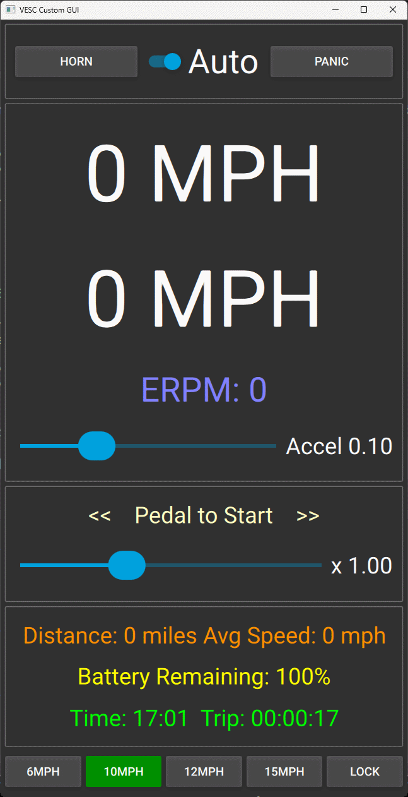

# PAS Throttle Cruise

Simple PAS system for VESC BBSHD. Developed using a Flipsky 75100 and VESC 6.05 firmware and tool.

This made to remove the need for a throttle (illegal in the UK, or at least "muddy" legality status)

Pas sensors are connected to RX and TX.

My brakes are simple switches rather than pots - so a 10k resistor from 3.3v connected to adc2 to make it work properly.

You'll need to upload these two files to your VESC controller:

- PasThrottleCruise.lisp - calculate the pedal RPM and pedal Count.

- PasThrottleCruise.qml -  The main app which reads the pedal count and exectues a really simple PAS system.

It's a "Virtual Throttle", you pedal forwards to increase the cruise speed or pedal backwards to decrease the speed.

## Status: In progress 

Currently fine tunning and testing. Trying to work out some smooth values e.t.c.

___Absolutely do not use this out on the road.___

You'll also need to setup your BBSHD properly for this to work.

## Some important settings include:

PID Controllers->Minimum ERPM

PID Controllers->Ramp eRPMs per second

Additional Info->Setup->Wheel diameter

App settings->general->Kill Switch mode.

## Brief UI description

The top two big MPH labels are target speed and actual speed.

Accel is how fast the erpm will get up to the target speed. (done with a 6db lpf)

The pedal to start slider - is how fast/slow the target speed will increment/decrement as you pedal.

Panic button STOPS EVERYTHING!

Horn button does nothing - no QML media libs connected.

Gradient Display removed - no QML sensor libs connected.

MPH buttons set the maxium target speed.

Lock button - locks the app - using the passwords defined.

passwordextra unlocks more speed buttons.

