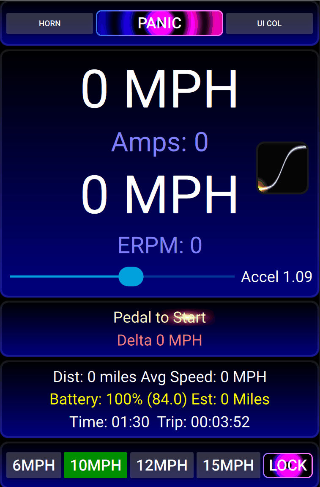

# Safety Lecture

> [!CAUTION]
> Before you even contemplate looking at this software - please read the following:

The BBSHD is a very powerful motor - if things go wrong, with low gearing it can easily physically overpower you (2.5kw = 3.3HP!) and pull you into traffic and splat - the end of you. This system uses a PID based setRpm() function - so it will attempt to match the speed you set - and ramp up the power until it reaches that speed - regardless of what's in front of you - a brick wall, a cliff, a 10 ton truck, a diabolical dr phibes bicycle trap e.t.c. . So unless you know what you are doing with this kind of software - just don't bother - you have to consider this "Life Critical" code - and apply development thoughts with that as the Key feature.

- if your brake cable disconnects - you can shut off the motor with the panic button or shutdown the app or disconnect the battery.
 
Programming is always prone to errors - it's the only sensible way to approach "life crictical" software - so you need bench test this first - wheels off ground or chain removed and make sure the speeds are correct and you're comfortable with how this all works.

Remember just the crank spinning gives no idea of real world acceleration and speed - so also start slow and low.

# VESC-BBSHD PAS Throttle Cruise


Simple PAS system for a VESC controller and a BBSHD motor. Developed using a Flipsky 75100 and VESC 6.05 firmware and tool.

This was made to remove the need for a throttle (illegal in the UK, or at least "muddy" legality status)

Pas sensors are connected to RX and TX.
> [!CAUTION]
> You must setup your brakes correctly - else you'll have a hard time stopping the motor

My brakes (NYK ZOOM HB-876-E MTB) are simple switches (2 pin connectors) rather than pots (3 pin connectors) - so a 10k resistor from 3.3v connected to ADC2 and then the brake switch from ADC2 to gnd - to make it work properly, no floating values or madness when the motor switches on e.t.c. NOTE - should be the reverse of this so when brakes get accidentally disconnected - vesc thinks the kill switch is on and can also test if brakes are connected or not e.t.c.

Vesc can only have 1 user QML app running. ADC app or any other buit in app that uses the three main motor controls: SetRPM, SetDuty or SetCurrent - will *FIGHT*
each other setting these values and end up in a right old mess. When you set "Custom User App" - ADC app gets shutdown.

You'll need to upload these two files to your VESC controller:

- PasThrottleCruise.lisp - calculate the pedal RPM and pedal Count.

- PasThrottleCruise.qml -  The main app which reads the pedal count and exectues a really simple PAS system.

- You need to set "App Settings"->"General"->"App to use" to "Custom User app" - then press the "Write app configuration" button
 
- Then on your android phone when the Vesc app connects - a eventually (can take 30secs vesc controller has to send the QML to your phone the first time you use that app) "App UI" tab will appear with the UI for this system

- Nothing will happen or work if your android Vesc app isn't running and connected to your Vesc controller.

It's a "Virtual Throttle", you pedal forwards to increase the cruise speed or pedal backwards to decrease the speed.

Braking will stop everything and reset the target speed to 0.

## Status: In progress 

Probably extremely dangerous at the moment - not to be used at all.

Currently fine tunning and testing. Trying to work out some smooth values e.t.c.

Testing to see if MPH and Battery estimator are correct.

> [!CAUTION]
> Absolutely do not use this out on the road - until you have Bench tested this thoroughly and are happy with how it works!
> it's still "in-progress" and will take many weeks to iron out bugs and issues. Use this software at your own risk - the author
> accepts no responsibility or liability for any damage or injuries incurred using this software.

Playing around with glES shaders - fun fun fun! Much easier to write complex GFX in gles than faff about with QML (which is great - but not for complex stuff)

Slowly putting all the comments back in and refactoring towards a proper release.
### Completed
- Motor and Vesc Temp (this was a real pain - inside motor , the temp JST connector didn't have a working pin connection for the Temp sensor! - twas a old BAC855 cable). BBSHD temp sensor seems to be NTC 10k@25c - that setting is in "Motor Settings"->"General"->"Temperature"->"Motor Sensor Temperature Type". 
- Slider lock
- Pole position shader
- Nightrider shader
- Extra buttons hidden with second password
- RPM Curves and independant accel settings
### ToDo

- front and rear gear input
- Speed/Distance testing
- More testing!!
- Refactor
- Serialize settings
- full Trip recording and viewable list
- Improve battery estimator
- Throttle control - maybe!
    
# Setting up BBSHD

It's really beyond the scope of this software documentation at the moment.
But once connected everything works as should:  hall sensors, brakes, Pedal encoder, Temp e.t.c.

## Some important settings include:

PID Controllers->Minimum ERPM  (Mine is set to 600)

PID Controllers->Ramp eRPMs per second (Mine is set to 2500) - this can be used as a acceleration setting, and it seems to be linear in nature. 

Additional Info->Setup->Wheel diameter

App settings->general->Kill Switch mode. (Mine is set to "ADC2 low")

> [!CAUTION]
> This only uses Wheel Diameter from the VESC app - does not read the gear ratio - that's hardcoded at the moment
> Line 58 in the QML file : property var gr: (8 x 21.92 x 28/42)

## Brief UI description

The top two big MPH labels are target speed and actual speed.

Accel is a divider for how many pedal rotations to get to max speed. This is linked to max speed, 20mph max speed takes 2x pedal rotations compared to 10mph e.t.c. Currently it's set to 5 full pedal rotations to get to 10mph if this slider is set to 1 and it would be 2.5 full pedal rotations to get to 10mph jf this slider is set to 2 e.t.c.

Use the "Slide to Activate" slider to make the system Active. Unslide it to deactivate it - this is here because a cruise system can be dangerous, even when just
walking the bike around - if it triggers even at very low speed it can push the handlebars in a wall and easily break the bones in your hand e.t.c.

Panic button STOPS EVERYTHING!

The curve window - shows the parametric position to the max mph set. i.e. the position of the "Virtual Throttle". Click on that to select between 3 different Curves: Fast in,Linear and Slow In.

Each curve also stores it's own accel slider setting - like a mini profile, handy!

"PAS Mode" button - when active switches off cruise mode - i.e. it stops the motor if you stop peddling.

MPH buttons set the maxium target speed.

Lock button - locks the app - using the passwords defined.

Using passwordextra instead of password to unlock will display four more speed buttons.

As soon as the motor starts spinning all buttons and sliders are disabled - apart from the "PANIC" button - safety first!




# VESC

So far my experience with VESC has been great - hats off to the developers for a really great slick system that enables you to tweak your ESC into whatever you want.
The whole VESC project is a monumental body of work, it handles many types of motors and setups - and it costs nothing (apart from the phone apps) - it's well written and documented plus all the source code is available. Couldn't have asked for anything better or more - Impressive stuff.

# LISP

It's all brackets!!! lol - it's simplistic parser uses polish notation instead of infix - it's fun and interesting, very simple nothing to stress out over.

Here's the code to read the BBSHD pedal encoder, using 4x reading at 1000hz and sending to QML at 10hz (takes 10-15% vesc cpu)

```
; <<PAS Throttle Cruise>>
;
; (C) 2025 S.D.Smith all rights reserved

(gpio-configure 'pin-tx 'pin-mode-in-pu)
(gpio-configure 'pin-rx 'pin-mode-in-pu)

(def pasPedalCount 0)
(def pasPedalRPM 0)

; swap 'pin-tx and 'pin-rx around if your pedals read the reverse direction - just means they are wired differently to mine RX and TX
(def prevH1 (gpio-read 'pin-tx))
(def prevH2 (gpio-read 'pin-rx))
(def sendRate 100)
(def sendCount sendRate)

(loopwhile t
{
    ; swap 'pin-tx and 'pin-rx around if your pedals read the reverse direction - just means they are wired differently to mine RX and TX
    (def h1 (gpio-read 'pin-tx))
    (def h2 (gpio-read 'pin-rx))

    (if (or (not ( = prevH1 h1)) (not ( = prevH2 h2)) )
    {

    (def cur (+ h1 (* h2 2)) )
    (def prev (+ prevH1 (* prevH2 2)) )

    (setq prevH1 h1)
    (setq prevH2 h2)

    (def pCPC pasPedalCount)

    (if (and (= prev 2) (= cur 0)) (setq pasPedalCount (+ pasPedalCount 1))    )
    (if (and (= prev 0) (= cur 1)) (setq pasPedalCount (+ pasPedalCount 1))    )
    (if (and (= prev 1) (= cur 3)) (setq pasPedalCount (+ pasPedalCount 1))    )
    (if (and (= prev 3) (= cur 2)) (setq pasPedalCount (+ pasPedalCount 1))    )

    (if (and (= prev 0) (= cur 2)) (setq pasPedalCount (- pasPedalCount 1))    )
    (if (and (= prev 1) (= cur 0)) (setq pasPedalCount (- pasPedalCount 1))    )
    (if (and (= prev 3) (= cur 1)) (setq pasPedalCount (- pasPedalCount 1))    )
    (if (and (= prev 2) (= cur 3)) (setq pasPedalCount (- pasPedalCount 1))    )
    (setq pasPedalRPM (+ pasPedalRPM (- pasPedalCount pCPC)))
    }
    )

    (setq sendCount (- sendCount 1))
    (if (< sendCount 0)
        {
        (setq sendCount sendRate)

        (def temppc (+ pasPedalCount 8388608))
        (send-data (list (+ (* pasPedalRPM 10) 128) (mod temppc 256) (mod (/ temppc 256) 256) (mod (/ temppc 65536) 256) ));
        }
    )

    (setq pasPedalRPM (* pasPedalRPM 0.95))

    (sleep 0.001)
}
)
```

# QML

QML is really nice and simple to make UI's very quickly - java style coding - quick and simple.
It's far easier and quicker to write a full blown app in QML than native C and build into the firmware - iteration times are waaay to slow to rebuild the firmware every time and reflash your vesc.

```
Component.onCompleted:
{
wheelDiameter=mMcConf.getParamDouble("si_wheel_diameter")*39.3701;
wheelDiameter=clamp(wheelDiameter,20,30);
minBat=mMcConf.getParamDouble("l_min_vin")
maxBat=84
}
```

You can only send u8's from lisp - so you have to break 'em up and offset if you wanna send larger ints e.t.c.

Sending data from lisp

```
(def temppc (+ pasPedalCount 8388608))
(send-data (list (+ (* pasPedalRPM 10) 128) (mod temppc 256) (mod (/ temppc 256) 256) (mod (/ temppc 65536) 256) ));
```

Reading data sent from lisp

```
Connections
{
target: mCommands
function onCustomAppDataReceived(data)
{
var dv = new DataView(data, 0)
pRPM = dv.getUint8(0)-128
var pp1=dv.getUint8(1)
var pp2=dv.getUint8(2)
var pp3=dv.getUint8(3)
pCount= (pp1+(pp2*256)+(pp3*256*256))-(256*256*256/2)
}
}
```

Shaders!!

If you want over the top crass garish UIs - QML can run glsl shader code - on both the desktop and android versions. Android version seems to use gles 1.00 - and my phones GL compiler is really strict - every numeric literal needs 0.0 formatting. No fwidth,fdfx,fdfy. uniform int or uniform bool don't seem to work on android and so you have to "convert" everything to a float to pass to a uniform:
```
property var colours: [Qt.vector3d(0,0,0),Qt.vector3d(0,0,0.5),Qt.vector3d(0.5,0,0),Qt.vector3d(0,0,0.0),Qt.vector3d(0,0,0),Qt.vector3d(0.5,0.5,0),Qt.vector3d(0,0,0),Qt.vector3d(0.5,0.25,0),Qt.vector3d(0,0,0),Qt.vector3d(0.0,0.0,0),Qt.vector3d(0.05,0.05,0.05),Qt.vector3d(0.15,0.15,0.15),Qt.vector3d(0.1,0.1,0.2),Qt.vector3d(0.1,0.1,0.2)]
property var colourIdx:0

Button
{
Layout.fillWidth: true
text: "UI Col"
id :uicolbutton
font.pointSize : 20
onClicked:
  {
  colourIdx=(colourIdx+2)%colours.length;
  }
background:Rectangle
  {
  layer.enabled: true;
  ShaderEffect
    {
    blending:false;
    width: parent.width
    height: parent.height
    property var source: parent
    property var time: stime
    property var rx : parent.width
    property var ry : parent.height
    property var down : (uicolbutton.pressed+0.001) // add a small float value to convert pressed to a float!
    property var sc: colours[colourIdx]
    property var ec: colours[colourIdx+1]
    fragmentShader: roundrectvgrad
    }
  }
}
```

heres the actual shader code for that:
```
// Shader header used by every shader to cut down code size since we only have around 4kb of compressed QML code
property var shdr : "varying highp vec2 qt_TexCoord0;
uniform highp float time;
uniform highp float rx;
uniform highp float ry;
uniform highp float down;
uniform highp float cidx;
uniform highp vec3 sc;
uniform highp vec3 ec;
uniform highp float p1;
#define tc qt_TexCoord0
#define gfc gl_FragColor
float sdBox(vec2 p,vec2 b ) // From IQ RGBAs [2D SDF functions](https://iquilezles.org/articles/distfunctions2d/)
{
vec2 d=abs(p)-b;
return length(max(d,0.0))+min(max(d.x,d.y),0.0);
}
"

property var roundrectvgrad:shdr+"
void main()
{
vec2 ss=(tc-0.5)*vec2(rx,ry);
float radius=min(min(15.0,rx/2.0),ry/2.0); // edge radius of 15
float dist=-(sdBox(ss,vec2(rx-radius*2.0,ry-radius*2.0)/2.0)-radius);
float alpha=smoothstep(0.5-1.0,0.5+1.0,dist);
vec3 colour=mix(sc,ec,tc.y);
if (dist<4.0) colour+=0.04;
colour+=down;
gfc=vec4(colour*alpha,alpha);
}"

```
~~Sometimes running QML script on Desktop vesc tool - it will run really slowly and lag a huge amount when sending commands to the VESC controller via bluetooth (a few seconds to a few mins!!!), that issue doesn't happen on a android phone - not figured out what is going on there - maybe spamming error messages is clogging up the BT comms or something?~~

*Note:* Turns out I was 60hz spamming VESC conroller with:

```
Timer {
id: motorpollTimer
interval: 100 // 100ms = 10hz - was 60hz - waaaay too much for BT - spammed the vesc and slow downs!
repeat: true
running: true
onTriggered:
  {
  if (!bikeLocked && brakesTested)
    updateMotor()
  mCommands.getValues()
  mCommands.sendAlive()
  }
}
```
changed that to 10hz and the laggy problem has gone "away".

# Flipsky

My Flipsky 75100 experience has been ok so far - I don't pull 4kw from it, max 2.5kw for steep hills - just 10-15mph lightweight ebiking on narrow paths - hence the lower speeds and safety.

USB comms: the USB cable - is right next to the phase wires in the cable exit hole on the 75100, so as soon as the motor turns on - USB comms usually fails.

~~Bluetooth comms: BT is a little flakey - think it's a issue with Winows 11. I developed this using win11 and a android phone, switching between the two was sometimes problematic. You have to wait till the Caps have fully discharged (Blue LED turns off) on the Flipsky when you turn it off before you turn it back on. Win 11 also sometimes doesn't disconnect from the flipsky when you shut down the VESC tool - and so you have to remove the BT device in windows and reboot and start again. When it's in this "stuck" state - nothing can connect to VESC Bluetooth - including android.~~

*Note:* Seems the win 11 lag and disconnect issue was linked to spamming the VESC controller as above - 10hz and all my Win11 issues go away! I'm guessing that the BT connection speed just can't handle 60hz worth of packets to and from VESC - and fills up a send queue which gets sent whever possible. I also changed the polling rate in VESC Tool->Edit->Preferences->Data Polling - all down to 1.0hz just in case that was also adding to the BT congestion.

```
Timer {
id: motorpollTimer
interval: 100 // 100ms = 10hz - was 60hz - waaaay too much for BT - spammed the vesc and slow downs!
repeat: true
running: true
onTriggered:
  {
  if (!bikeLocked && brakesTested)
    updateMotor()
  mCommands.getValues()
  mCommands.sendAlive()
  }
}
```

# BBSHD

What a superb motor! - built like a tank!! I've ridden 10,000 miles plus over the 5 years I've owned the BBSHD. No problems with it at all - no noises or issues. I gear 28/32 for hill climbing torque and I think that's the key to the BBSHD longevity - it likes to spin fast (all motors do :) ) - and that stops the internal nylon gear from melting!

Gearing low - not only saves the nylon gear - it also saves the chain - I've had the same flimsy chain for 10,000 miles - zero damage to it - even on extreme hills (up to 35% grads).

In fact a single gear setup, is perfect with BBSHD - no messing with derailleurs and all the problems they bring (they're just not up to spec to handle 2500w+). You can then choose your gearing to fit your ridiing environment and that's a massive improvement over fixed gear hub motors.

High Voltage!!! That's also another key to BBSHD longevity - the higher the voltage the faster the motor can spin, also Higher voltage means less current and less "copper loses" for the same amount of power. Less current also has less wear on your batteries. So it's a win win situation all round!

When you gear low the motor spends less time in the low rpm and needs less current to get higher rpm - which also uses less current. So it's potentially more
effcient. (Of course it's a lot more complex than that - as RPM increases, parasitic losses increasing and copper losses decrease so there's a balance to be reached.)

so Gear low and Voltage high!!!
 
BBSHD has a 24kv rating? so 72v=1636 rpm = 1636x8x21.9 = 291456 erpm. (not sure how accurate or correct these figures are)

BBSHD pas sensor seems to have 24 magnets - so with 4x encoder reading that gives 96 discrete pedal positions.


