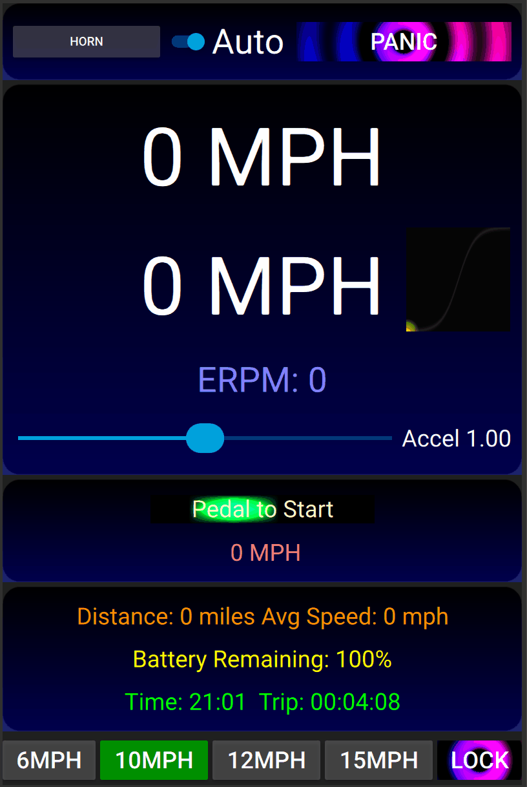

# VESC-BBSHD PAS Throttle Cruise

Simple PAS system for a VESC controller and a BBSHD motor. Developed using a Flipsky 75100 and VESC 6.05 firmware and tool.

This was made to remove the need for a throttle (illegal in the UK, or at least "muddy" legality status)

Pas sensors are connected to RX and TX.

My brakes (NYK ZOOM HB-876-E MTB) are simple switches (2 pin connectors) rather than pots (3 pin connectors) - so a 10k resistor from 3.3v connected to ADC2 and then the brake switch from ADC2 to gnd - to make it work properly, no floating values or madness when the motor switches on e.t.c.

You'll need to upload these two files to your VESC controller:

- PasThrottleCruise.lisp - calculate the pedal RPM and pedal Count.

- PasThrottleCruise.qml -  The main app which reads the pedal count and exectues a really simple PAS system.

It's a "Virtual Throttle", you pedal forwards to increase the cruise speed or pedal backwards to decrease the speed.

Braking will stop everything and reset the target speed to 0.

## Status: In progress 

Currently fine tunning and testing. Trying to work out some smooth values e.t.c.

Testing to see if MPH and Battery estimator are correct.

# Absolutely do not use this out on the road. Bench testing only!

Playing around with glES shaders - fun fun fun!

Sadly had to remove most comments in code, get the file sizes down so I could upload to vesc flash e.t.c.

You'll also need to setup your BBSHD properly for this to work.

## Some important settings include:

PID Controllers->Minimum ERPM  (Mine is set to 600)

PID Controllers->Ramp eRPMs per second (Mine is set to 2500) - this can be used as a acceleration setting, and it seems to be linear in nature. 

Additional Info->Setup->Wheel diameter

App settings->general->Kill Switch mode. (Mine is set to "ADC2 low")

## Brief UI description

The top two big MPH labels are target speed and actual speed.

Accel is a mulitiplier/divider for how many pedal rotations to get to max speed. This is linked to max speed, 20mph max speed takes 2x pedal rotations compared to 10mph e.t.c. Currently it's set to 5 full pedal rotations to get to 10mph.

Panic button STOPS EVERYTHING!

The sigmoid curve - shows the parametric position to the max mph set. i.e. the position of the "Virtual Throttle". 

Horn button does nothing - no QML media libs connected.

Gradient Display removed - no QML sensor libs connected.

MPH buttons set the maxium target speed.

Lock button - locks the app - using the passwords defined.

Using passwordextra instead of password to unlock will display four more speed buttons.

As soon as the motor starts spinning all buttons and sliders are disabled - apart from the "PANIC" button - safety first!

# VESC

So far my experience with VESC has been great - hats off to the developers for a really great slick system that enables you to tweak your ESC into whatever you want.

# Flipsky

My Flipsky 75100 experience has been ok so far - I don't pull 4kw from it, max 2.5kw for steep hills - just 10-15mph lightweight ebiking on narrow paths - hence the lower speeds and safety.

USB comms: the USB cable - is right next to the phase wires in the cable exit hole on the 75100, so as soon as the motor turns on - USB comms usually fails.

Bluetooth comms: BT is a little flakey - think it's a issue with Winows 11. I developed this using win11 and a android phone, switching between the two was sometimes problematic. You have to wait till the Caps have fully discharged (Blue LED turns off) on the Flipsky when you turn it off before you turn it back on. Win 11 also sometimes doesn't disconnect from the flipsky when you shut down VESC tool - and you have to remove the BT device in windows and reboot and start again.

# BBSHD

What a superb motor! - built like a tank!! I've ridden 10,000 miles plus over the 5 years I've owned the BBSHD. No problems with it at all - no noises or issues. I gear 28/32 for hill climbing torque and I think that's the key to the BBSHD longevity - it likes to spin fast (all motors do :) ) - and that stops the internal nylon gear from melting!

# Safety Lecture

The BBSHD is a very powerful motor - if things go wrong it can easily overpower (2.5kw = 3.3HP!) you and pull you into traffic and splat. This system uses PID setRpm() - so it will attempt to match the speed you set - and ramp up the power until it reaches that speed. So unless you know what you are doing with this kind of software - just don't bother - you have to consider this "Life Critical" code - and apply development thoughts with that as the Key feature.

- if your brake cable disconnects - you can shut off the motor with the panic button or shutdown the app or disconnect the battery.
